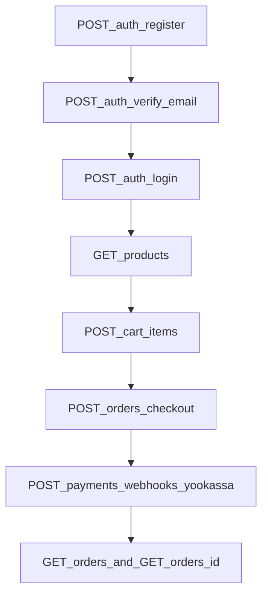

# API Guide

## Base setup

- Prefix: `/api`
- Swagger UI: `/api/docs`
- Auth: `Bearer` token for protected endpoints

## Main endpoint groups

- `auth` - register/login/refresh/logout/password reset/OAuth.
- `profile`, `address`, `settings` - user account endpoints.
- `catalog` - categories, product list, product details, recommendations, filters.
- `reviews` - create/update/delete user reviews, list product reviews.
- `cart` - cart CRUD and totals.
- `orders` - checkout, list details, cancel.
- `payments` - payment details and YooKassa webhooks.

## Typical user flow

## Recommended manual smoke checks

1) Register + verify + login.
2) Add item to cart and confirm totals.
3) Checkout and fetch payment/order details.
4) Create a review and confirm product rating changes.

## Webhook notes

- Endpoint: `POST /api/payments/webhooks/yookassa`
- Signature header: `x-yookassa-signature`
- Secret source: `YOOKASSA_WEBHOOK_SECRET`
- Webhook events are stored for idempotency in `payment_webhook_events`.
