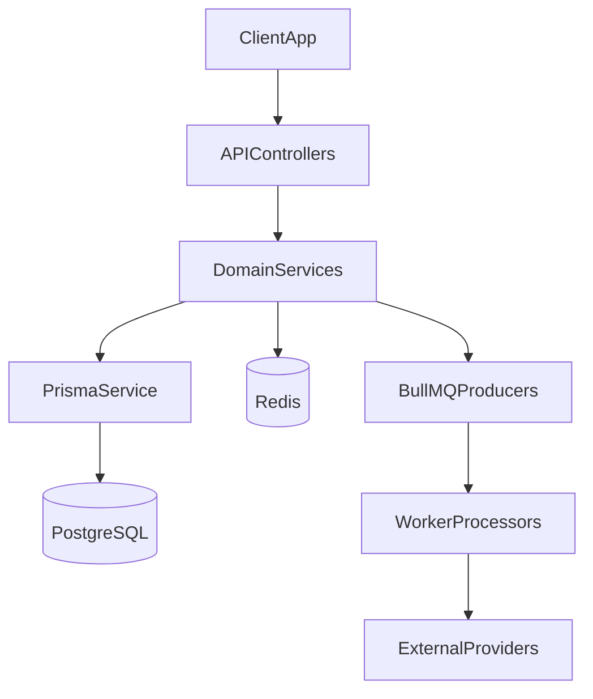

# Architecture

## Application shape

The project is a modular NestJS monolith with:

- REST API (`src/main.ts`, `src/app.module.ts`)
- Background workers (`src/worker.ts`, `src/worker.module.ts`)
- PostgreSQL + Prisma for primary data
- Redis for throttling, cache and BullMQ backend

## Business modules

- `auth` - local and OAuth authentication, token lifecycle.
- `profile`, `address`, `settings` - user profile and account preferences.
- `catalog` - category tree, product catalog, variants, images, attributes.
- `reviews` - user reviews and product rating aggregates.
- `cart` - mutable user basket.
- `orders` - checkout and order lifecycle.
- `payments` - payment creation and webhook processing.
- `notifications` - integrations for outbound notifications.

## Supporting modules

- `database` - Prisma module/service.
- `config` - environment validation and app config mapping.
- `common` - shared DTO helpers, filters, middleware, utils.
- `queues` - queue modules, producers and processors.

## Queue topology

- Queue: `auth-email` - verification/reset email jobs.
- Queue: `product-search-index` - async product indexing jobs.

Workers are bootstrapped in `src/worker.module.ts` and run as a separate process (`npm run start:worker*`).

## High-level data flow

## Key domain relationships

- `User` owns `UserSettings`, `UserAddress`, optional `Cart`, and `Order`.
- `Category` organizes `Product` via hierarchy.
- `Product` has `ProductVariant`, `ProductImage`, `ProductAttributeValue`, `Review`.
- `CartItem` references `Product` + `ProductVariant`.
- `OrderItem` stores immutable snapshots for purchased lines.
- `Payment` is 1:1 with `Order`.
